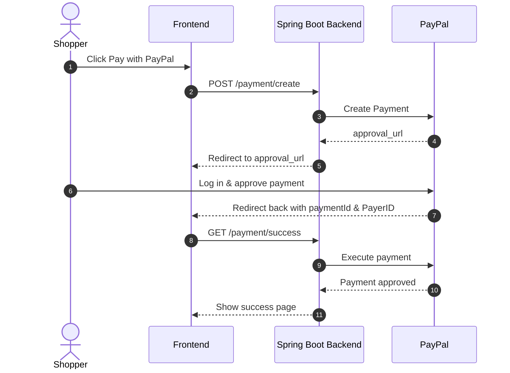

# PayPal × Spring Boot 3 — Minimal & Secure Payment Integration

This project is a clean and lightweight implementation of PayPal payment integration using Spring Boot 3 and the official PayPal REST API SDK (v1.14.0).

It handles the full redirect-based payment flow (used for both PayPal wallet and card payments), without storing any sensitive card data on your server — keeping things safe, simple, and PCI-compliant.


## Here’s what I implemented:

- A complete PayPal redirect payment flow — from creating a payment to handling success or cancellation.
- Just three endpoints to cover the whole journey:
  - POST /payment/create → starts the payment process
  - GET /payment/success → confirms and executes the payment
  - GET /payment/cancel → handles when the user cancels
- Built with Spring Boot 3, Java 17, and a basic Thymeleaf UI.

---

## How does the PayPal payment flow work?   
   it’s based on redirection to PayPal’s hosted page:



---

## Step-by-step: What happens when a user pays?

1. The user clicks “Pay with PayPal”  
   They’ve chosen their product, and they’re ready to pay.

2. A request is sent to our backend (/payment/create)  
   The server (using the PayPal SDK) creates a payment session and tells PayPal what the user is paying for.

3. PayPal responds with an approval URL  
   That’s the special link where the user will go to log in and confirm the payment.

4. The backend redirects the user to PayPal  
   Using a 302 redirect, the user is sent straight to PayPal’s secure hosted payment page.

5. The user logs into PayPal and approves the payment  
   PayPal takes care of authentication and payment confirmation.

6. PayPal redirects the user back to your app  
   If all goes well, PayPal sends them to /payment/success with a paymentId and PayerID.

7. Your backend finalizes the payment  
   The server calls PayPal again to execute the payment using the data it received.

8. The user sees a success (or failure) page  
   If everything worked, they get a confirmation message. If not, you can show an error or cancellation notice.

---


## Testing with PayPal Sandbox

Before going live, you can test everything using PayPal's developer sandbox:

1. Create a sandbox Business Account (for receiving money)
2. Create a sandbox Personal Account (to simulate the buyer)
3. Add your credentials in application.properties:

```properties
paypal.client.id=YOUR_SANDBOX_CLIENT_ID
paypal.client.secret=YOUR_SANDBOX_CLIENT_SECRET
paypal.mode=sandbox
```


