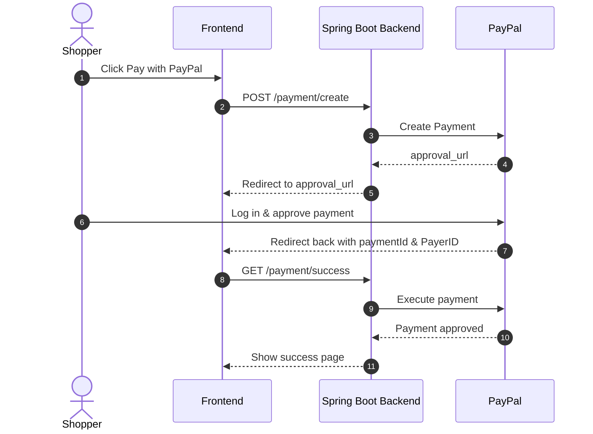

# PayPal × Spring Boot 3 — Minimal & Secure Payment Integration

### The Problem We’re Solving

We want users to pay on our website securely, without ever touching or storing their card details. That means:

- We can’t (and shouldn’t) handle sensitive card data.
- We don’t want to deal with PCI-DSS compliance.
- We need to make sure that funds are only transferred when the user confirms the payment.

---

### Why We Use PayPal

PayPal handles the hard stuff for us:

- They collect the card or wallet info.
- They manage authentication and 3D Secure.
- They talk to banks and process the payment.
- They return the result once the user approves.

Your backend simply initiates the payment and waits for the result.

---

## What’s included in this project?

Here’s what I implemented:

- A complete PayPal redirect payment flow — from creating a payment to handling success or cancellation.
- Just three endpoints to cover the whole journey:
  - POST /payment/create → starts the payment process
  - GET /payment/success → confirms and executes the payment
  - GET /payment/cancel → handles when the user cancels
- Built with Spring Boot 3, Java 17, and a basic Thymeleaf UI.

---

## How does the PayPal payment flow work?

Here’s a quick visual overview of how the flow goes — it’s based on redirection to PayPal’s hosted page:



---

### Step 1: Create a Payment Request

When the user clicks “Pay with PayPal”, your backend calls PayPal’s API to create a payment. You provide:

- The amount (e.g. $10)
- The currency (e.g. USD)
- A cancel_url (in case the user bails out)
- A success_url (if the payment is approved)

```java
Payment payment = paypalService.createPayment(...);
```

---

### Step 2: PayPal Returns Multiple Links

PayPal responds with a Payment object that includes several links, like:

| rel             | Purpose |
|------------------|---------|
| self             | Status link for the current payment |
| approval_url     | Where the user should go to approve the payment |
| execute          | Used to finalize the payment after approval |

What we care about most is approval_url. That’s the page where the user logs into PayPal and confirms the payment.

So the code loops through the links and redirects to that one:

```java
for (Links link : payment.getLinks()) {
    if (link.getRel().equalsIgnoreCase("approval_url")) {
        return new RedirectView(link.getHref());
    }
}
```

---

### Step 3: User Logs In and Approves the Payment

Once the user is redirected to PayPal, they log in and approve the payment. Then, PayPal redirects them back to the success_url you originally provided — with two query parameters:

- paymentId
- PayerID

---

### Step 4: Execute the Payment

Now that the user has approved the payment, your backend needs to confirm it by calling PayPal again using the IDs provided.

```java
public Payment executePayment(String paymentId, String payerId) throws PayPalRESTException {
    Payment payment = new Payment();
    payment.setId(paymentId);

    PaymentExecution execution = new PaymentExecution();
    execution.setPayerId(payerId);

    APIContext context = new APIContext(clientId, clientSecret, mode);

    return payment.execute(context, execution);
}
```

This is the final step in the flow — the actual money transfer only happens here.

---

### Why the Two-Step Process(create/execute)?

PayPal splits the flow for a reason:

1. Security – Nothing happens until the user explicitly confirms.
2. Control – You decide when to execute the payment, even after approval.
3. Fail Safety – If the user abandons the flow, no payment is charged.

---

### Final Step: Show the Result

If the returned payment status is approved, you show a success message. Otherwise, redirect to an error or cancel page.

```java
if ("approved".equalsIgnoreCase(payment.getState())) {
    return "Payment Success";
}
```

---

### Example Redirect URL from PayPal

After the user approves the payment, PayPal will redirect them to:

```
http://localhost:8080/payment/success?paymentId=PAY-1234567890ABCDE&PayerID=ABCD1234
```

---

### Summary of the Full Flow

| Step | What Happens | Why |
|------|---------------|-----|
| 1 |  backend calls PayPal to create a payment | You provide amount, currency, return URLs |
| 2 | PayPal responds with approval_url | User must log in and confirm payment |
| 3 | User is redirected to PayPal | PayPal handles auth and UI |
| 4 | PayPal redirects user back to your site | Includes paymentId and PayerID |
| 5 |  backend calls executePayment | This actually charges the money |
| 6 | You show success or failure to the user |  update your system accordingly |

---


## Testing with PayPal Sandbox

Before going live, you can test everything using PayPal's developer sandbox:

1. Create a sandbox Business Account (for receiving money)
2. Create a sandbox Personal Account (to simulate the buyer)
3. Add your credentials in application.properties:

```properties
paypal.client.id=YOUR_SANDBOX_CLIENT_ID
paypal.client.secret=YOUR_SANDBOX_CLIENT_SECRET
paypal.mode=sandbox
```


